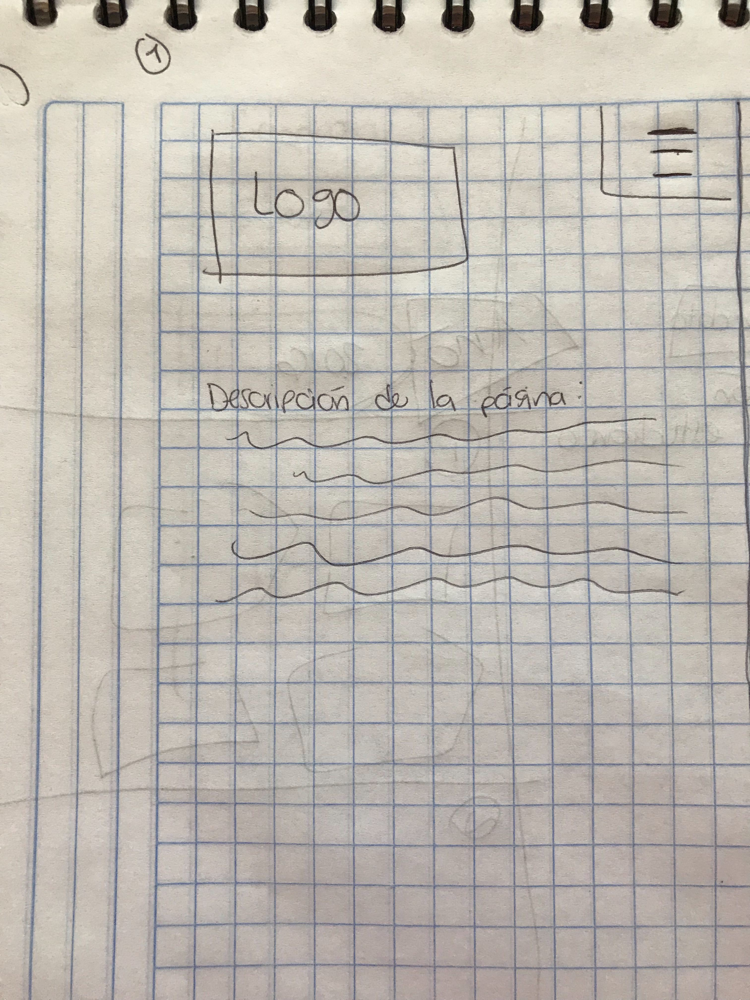
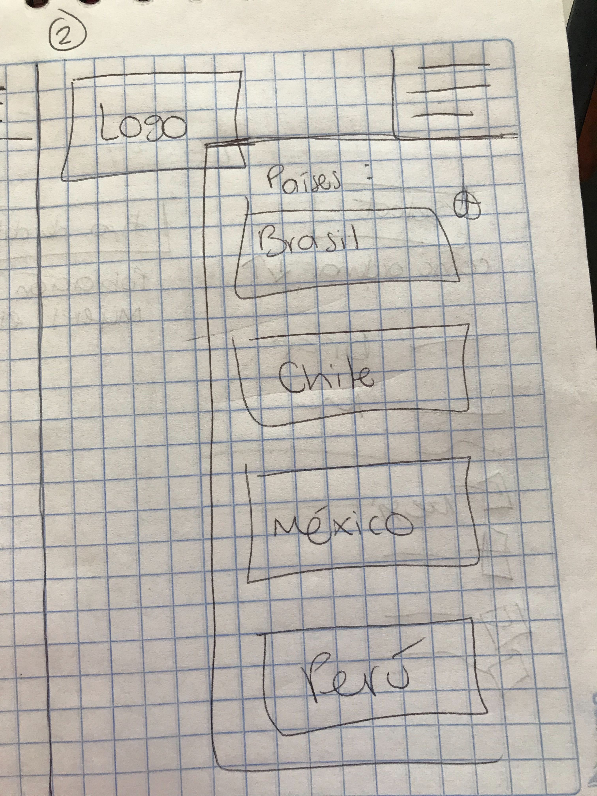
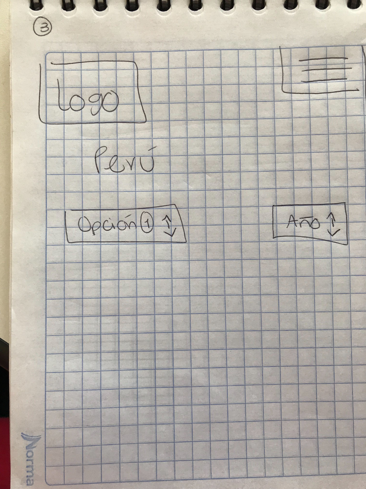
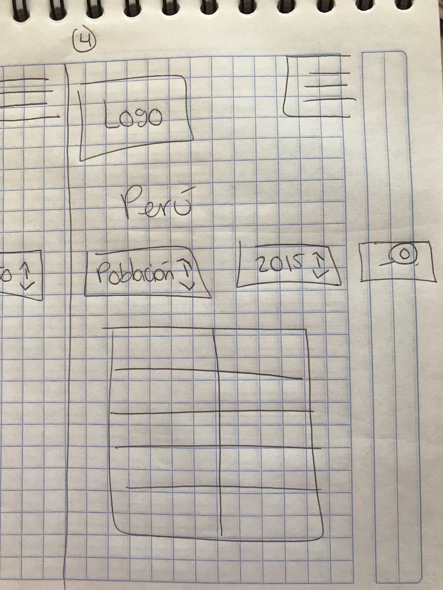
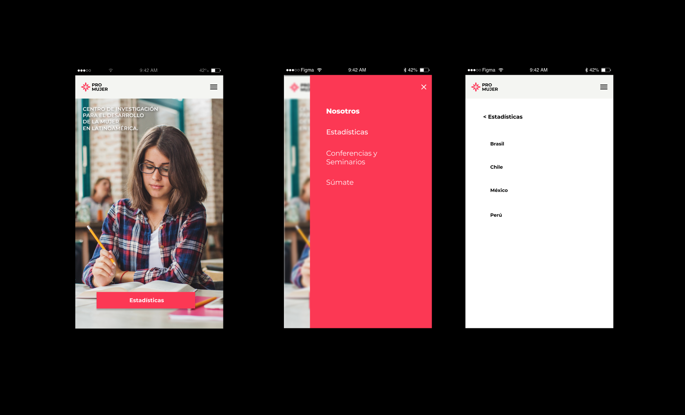
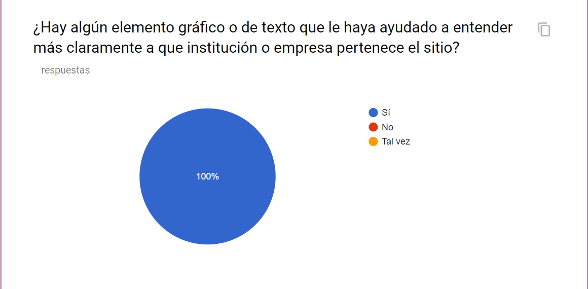
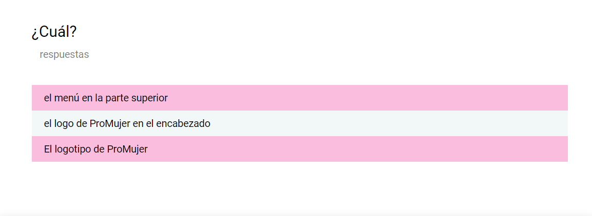
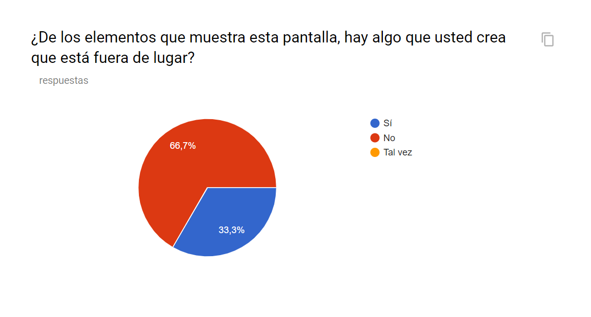
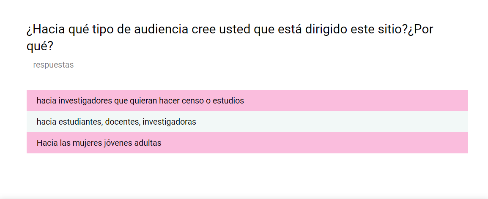
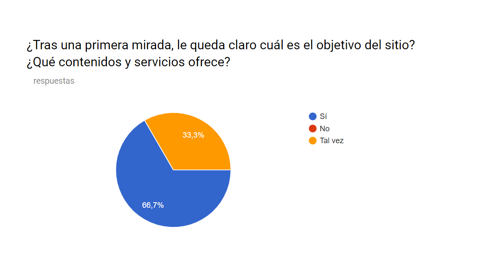

# ProMujer

## Índice

- [Preámbulo](#preámbulo)
- [Descripción](#resumen-del-proyecto)
- [Consideraciones generales](#consideraciones-generales)
- [Consideraciones técnicas](#consideraciones-técnicas)
- [Primeros pasos](#primeros-pasos)
- [Contenido de referencia](#contenido-de-referencia)
- [Checklist](#checklist)


## Preámbulo

Una niña o una mujer que asiste a la escuela está realizando su derecho humano fundamental a la educación. Además tiene una mayor posibilidad de realizar su pleno potencial en el transcurso de la vida, ya que estará mejor preparada para obtener un trabajo decente y bien remunerado, por ejemplo, o alejarse de un hogar violento.

La educación es esencial para que las mujeres puedan alcanzar la igualdad de género y convertirse en agentes de cambio. Al mismo tiempo, las mujeres educadas benefician a las sociedades enteras. Contribuyen de modo sustancial a las economías prósperas y a mejorar la salud, la nutrición y la educación de sus familias.

Las regiones en desarrollo han alcanzado o están cerca de alcanzar la igualdad de género en la escuela primaria. Sin embargo, estas diferencias de género aumentan en la educación secundaria y superior. 

Algunas de las discrepancias más profundas persisten en los países más pobres. En todo el mundo, el 80 por ciento de las mujeres adultas sabe leer, pero eso se compara con casi el 89 por ciento de los hombres, mientras que en los países menos desarrollados, solo el 51 por ciento de las mujeres sabe leer y escribir.

La discriminación de género debilita de muchas formas las perspectivas de las mujeres de recibir una educación. Los matrimonios a edad temprana y el trabajo doméstico llevan a muchas niñas y jóvenes a abandonar la escuela. El acoso sexual en los espacios públicos puede confinarlas a sus hogares.

El sesgo de género en los materiales educativos y pedagógicos limita los campos de estudio y margina a las mujeres. Incluso cuando más mujeres se están matriculando en las universidades, muchas se detienen antes de llegar a los títulos avanzados.

El reciente progreso mundial hacia la enseñanza primaria universal es loable. Pero para las mujeres y las niñas es insuficiente. La falta de escolarización, la pobreza, el desempleo y los peores trabajos todavía recaen de forma desproporcionada en las mujeres. La educación es su derecho y su camino a un futuro mejor.

Por ello, la investigación para el Desarrollo de la mujer es el objetivo principal de ProMujer, y con ello promover e impulsar la igualdad de género y el empoderamiento de las mujeres en América Latina.

### Definición del producto

El desarrollo de esta aplicación web tiene como objetivo servir de apoyo a las organizaciones educativas no lucrativas y sus colaboradores, interesados en impulsar el desarrollo de la mujer a través de la educación. 

ProMujer es un Centro de investigación para el Desarrollo de la mujer en América Latina que cuenta con programas de investigación y desarrollo, publicación de contenidos, eventos, etc.

Aprovecha su presencia mundial y las alianzas con sus asociados para fomentar la igualdad de género. El Plan de Acción para la Igualdad entre los Géneros es la guía para hacer que las reglas del juego sean más justas.

## Primera iteración 

### Historias de usuario

Al realizar las historias de nuestros usuarios, encontramos que las más recurrentes son:

- Usuario 1: Yo como usuario necesito ver un menú con los países de América Latina y sus niveles en educación.

- Usuario 2: Yo como usuario quiero acceder rápidamente a los indicadores según el país de mi interés.


### Diseño de la Interfaz de Usuario

Con el objetivo de facilitar a los usuarios la navegación por nuestra web app, diseñamos una interfaz gráfica con un look & feel simple y concreto, por medio de los siguientes elementos:

- Identificación: Agregamos un nombre a la web (ProMujer), logo, banner en el main, frase corta con el tema principal.

- Navegación: Agregamos el Menú principal, elemento de regreso a la home, información sobre la ubicación del usuario dentro del sitio web, títulos y textos en un lenguaje claro y conciso, presentados en un formato agradable y de fácil lectura

- Interacción: Para provocar la interacción del usuario, ofrecemos la posibilidad de realizar acciones específicas, para que elija el contenido de su interés.

- Paleta de color: 
    Amarrillo, para elementos de mayor jerarquía. 
    Gris, para textos y elementos de poco peso visual.
    Blanco, para hacer pausas a través de espacios vacíos (background). 
    
- Tipografía: Roboto sans-serif para darle un aspecto fresco, simple y legible a la página web.

- Plecas: Se utilizaron para dividir visualmente cada sección de la página.  

- Banner: Uso de banner como elemento princial, que reafirme al usiario el contenido de esta web app.

#### Prototipo de baja fidelidad
Para iniciar nuestro diseño partimos desde un dispositivo mobile. Nuestros primeros sketch son los siguientes:






#### Prototipo de alta fidelidad
El prototipo de alta fidelidad sufrió cambios a lo largo de las iteraciones del producto, con base a los resultados obtenidos en las encuestas.




#### Testeos de usabilidad

Se realizaron encuestas principalmente a profesionales y voluntarios que trabajan en asociaciones no lucrativas. Con el objetivo de conocer su principal impresión del producto.

Los principales problemas que se detectaron en las pruebas de usabilidad fueron:

-Páginas muy complejas de manejar.

-Páginas con diseño poco atractivo.

-Páginas con mucha información.

-Páginas con información no jerarquizada.







## Segunda iteración 

### Historia de mi Proto Persona

Datos personales:

Nombre: Gabriela Rocha
Edad: 35 años
Ciudad de México
Estudios: Psicología, Maestría en Administración Pública
Empresa y Cargo: Laboratoria / Partner & COO  (Socia y Directora de Operaciones)
Labor en la empresa: Dirigir los equipos de Operaciones de Laboratoria en América Latina, identificar y lanzar nuevas ubicaciones para el crecimiento y fortalecer la cultura de la organización en todos los equipos.
Medio de transporte al trabajo: Coche
Dispositivos tecnológicos usa regularmente: Móvil, Laptop (apple)
Dispositivo tecnológico que usa principalmente para obtener información: Móvil, Laptop

### Historias de usuario

- Yo como usuario necesito conocer los niveles en educación de las mujeres en América Latina para identificar zonas de mayor necesidad, y así, proponer y lanzar nuevas ubicaciones para la expansión de la organización a la que pertenezco.  

#### Testeos de usabilidad

Se realizaron test con usuarios de escolaridad mínima de licenciatura, en actividad laboral, viviendo en la Ciudad de México, en edades de los 30 a los 35 años de edad.

La prueba se realizó con el uso de la web app versión desktop, teniendo 10 minutos para navegar en la página web.

Los comentarios de los usuarios despúes de la prueba, fueron:

- El logo parece arbolito de navidad.
- Para el botón de estadísticas hace falta un texto que haga referencia al contenido que va a mostrar.
- Botón de estadísticas, la transparencia del hover no es legible.
- Radios: Incluir que se ordenan los porcentajes (%).
- Hacer tablas o gráficas para mayor comprensión de los datos.
- Botones de cada país con hover o encendido-on, una ves que se selecciona uno de ellos.
- Texto descriptivo que haga referencia al indicador que se despliega. 
- Selector de indicadores con texto previa (placeholder). 
- En la tabla resaltar los porcentajes (%).
- Resumir sección “nosotros”.
- Contacto: Quitar telefonos, sobran.

#### Prototipo de alta fidelidad
El prototipo de alta fidelidad sufrió cambios a lo largo de las iteraciones del producto, con base a los resultados obtenidos en las encuestas.


### Pruebas unitarias

Se implementaron pruebas unitarias para las funciones encargadas de
_procesar_, _filtrar_ y _ordenar_ la data.
Para ello se implementaron las siguientes funciones en el archivo
`src/data.js`:

- `filterData(data, condition)`: esta función `filter` o filtrar recibe la
  data, y nos retorna aquellos datos que sí cumplan con la condición.

- `sortData(data, sortBy, sortOrder)`: esta función `sort` u ordenar
  recibe tres parámetros.
  El primer parámetro, `data`, nos entrega los datos.
  El segundo parámetro, `sortBy`, nos dice con respecto a cuál de los campos de
  la data se quiere ordenar.
  El tercer parámetro, `sortOrder`, indica si se quiere ordenar de manera
  ascendente o descendente.

## Consideraciones técnicas

La lógica del proyecto está implementada completamente en JavaScript
(ES6), HTML y CSS. 

Se implementaron pruebas unitarias para validar las funciones encargadas de procesar, filtrar y ordenar la data. Estos test se realizaron con [Jest](https://jestjs.io/).

Como gestor de proyecto de utilizó NPM (Node Package Manager).

El _boilerplate_ contiene una estructura de archivos como punto de partida así
como toda la configuración de dependencias:

```text
.
├── package.json
├── README.md
├── src
│   ├── data
│   │   ├── injuries
│   │   │   ├── injuries.js
│   │   │   └── injuries.json
│   │   ├── lol
│   │   │   ├── lol.js
│   │   │   └── lol.json
│   │   ├── pokemon
│   │   │   ├── pokemon.js
│   │   │   └── pokemon.json
│   │   ├── steam
│   │   │   ├── steam.js
│   │   │   └── steam.json
│   │   └── worldbank
│   │       ├── worldbank.js
│   │       └── worldbank.json
│   ├── data.js
│   ├── index.html
│   ├── main.js
│   └── style.css
└── test
    └── data.spec.js

8 directories, 17 files
```

## Cómo empezar a trabajar en el proyecto

Para empezar se sugiere:
1. Realizar un :fork_and_knife:
   [fork](https://help.github.com/articles/fork-a-repo/) del repo.
2. :arrow_down: [Clona](https://help.github.com/articles/cloning-a-repository/)
   tu :fork_and_knife: a tu computadora (copia local).
3. 📦 Instalar las dependencias del proyecto con el comando `npm install`. Esto
   asume que has instalado [Node.js](https://nodejs.org/) (que incluye [npm](https://docs.npmjs.com/)).
4. Si todo ha ido bien, deberías poder ejecutar las :traffic_light:
   pruebas unitarias (unit tests) con el comando `npm test`.
5. A codear se ha dicho! :rocket:


## Contenido de referencia

### Diseño de experiencia de usuario (User Experience Design)

- Investigación con usuarios / entrevistas
- Principios de diseño visual

### Desarrollo Front-end

- Unidad de testing en curso de JavaScript en LMS.
- Unidad de arreglos en curso de JavaScript en LMS.
- Unidad de objetos en curso de JavaScript en LMS.
- Unidad de funciones en curso de JavaScript en LMS.
- Unidad de DOM en curso de Browser JavaScript en LMS.
- [Array en MDN](https://developer.mozilla.org/es/docs/Web/JavaScript/Referencia/Objetos_globales/Array)
- [Array.sort en MDN](https://developer.mozilla.org/es/docs/Web/JavaScript/Referencia/Objetos_globales/Array/sort)
- [Array.map en MDN](https://developer.mozilla.org/es/docs/Web/JavaScript/Referencia/Objetos_globales/Array/map)
- [Array.filter en MDN](https://developer.mozilla.org/es/docs/Web/JavaScript/Referencia/Objetos_globales/Array/filter)
- [Array.reduce en MDN](https://developer.mozilla.org/es/docs/Web/JavaScript/Referencia/Objetos_globales/Array/reduce)
- [Array.forEach en MDN](https://developer.mozilla.org/es/docs/Web/JavaScript/Referencia/Objetos_globales/Array/forEach)
- [Object.keys en MDN](https://developer.mozilla.org/es/docs/Web/JavaScript/Referencia/Objetos_globales/Object/keys)
- [Object.entries en MDN](https://developer.mozilla.org/es/docs/Web/JavaScript/Referencia/Objetos_globales/Object/entries)
- [Fetch API en MDN](https://developer.mozilla.org/en-US/docs/Web/API/Fetch_API)
- [json.org](https://json.org/json-es.html)

### Herramientas

- [Git](https://git-scm.com/)
- [GitHub](https://github.com/)
- [GitHub Pages](https://pages.github.com/)
- [Node.js](https://nodejs.org/)
- [Jest](https://jestjs.io/)

---

## Checklist

- [ ] Usa VanillaJS.
- [ ] No hace uso de `this`.
- [ ] Pasa linter (`npm pretest`)
- [ ] Pasa tests (`npm test`)
- [ ] Pruebas unitarias cubren un mínimo del 70% de statements, functions y
      lines y branches.
- [ ] Incluye _Definición del producto_ clara e informativa en `README.md`.
- [ ] Incluye historias de usuario en `README.md`.
- [ ] Incluye _sketch_ de la solución (prototipo de baja fidelidad) en
      `README.md`.
- [ ] Incluye _Diseño de la Interfaz de Usuario_ (prototipo de alta fidelidad)
      en `README.md`.
- [ ] Incluye el listado de problemas que detectaste a través de tests de
      usabilidad en el `README.md`.
- [ ] UI: Muestra lista y/o tabla con datos y/o indicadores.
- [ ] UI: Permite ordenar data por uno o más campos (asc y desc).
- [ ] UI: Permite filtrar data en base a una condición.

## Checklist (Opcional)

- [ ] Consume data de forma dinámica (`fetch()`).
- [ ] Utiliza Librerías de graficas (`chart.js` ó `google chart`).
- [ ] Cobertura de coverage al 100%.


